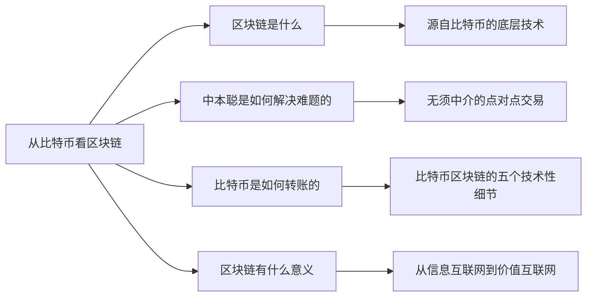

+++
title = "区块链超入门-1-区块链1.0从比特币看区块链-1.0-专题讨论"
date = "2021-04-03T23:17:10+08:00"
tags = ["区块链超入门"]
slug = "区块链超入门-1-区块链1.0从比特币看区块链-1.0-专题讨论"

+++

### 『专题讨论』说区块链时,我们在说什么?

比特币系统包括三层：比特币、比特币协议、比特币区块链，即比特币的分布式账本与去中心网络。那么，从比特币系统来对照看，说区块链时，我们说的可能是什么？

图1-6：从比特币系统看区块链是什么

区块链这个说法包括四种可能性，所覆盖的范围逐步变大，(见图1-6)：

- 可能性之一，区块链指的是比特币的数据结构，即由数据块（block）连接形成的链（chain），这也被称为“分布式账本”。在比特币白皮书中，中本聪分别提及了区块和链，但后来它们才被组合成了区块链（blockchain）这个新词。
- 可能性之二，区块链指的是比特币的分布式账本和去中心网络的组合。对应于比特币系统，它指的是整个第三层比特币区块链。
- 可能性之三，区块链指的是比特币系统的第二层（比特币协议）和第三层（比特币区块链）的组合。它包括分布式账本、去中心网络和比特币协议。
- 可能性之四，区块链指的是整个比特币系统，包括所有三层，既包括价值表示的比特币，也包括了背后支撑的整个系统。从这个范围看，是把区块链看成一个既包括技术部分，又包括经济部分的完整系统。

大众在提及区块链时，常指的是第四种最大的范围，即“账本+网络+协议+货币”。在产业中，人们在提到区块链时，通常指的是第三种范围，即“账本+网络+协议”。而很多软件开发者在说起区块链时通常指的是第二种范围“账本+网络”，即分布式账本加去中心网络。

现在，包括我在内的很多人都有一种看法是，将基于区块链的价值表示物都称为通证，并把比特币等代币（coin）视为通证的一个特定种类。通常而言，提及加密数字货币、通证、代币时，我们指的都是基于区块链的、在数字世界中进行价值表示的事物。如果采用“通证”说法，区块链的最大范围包括的则是“账本+网络+协议+通证”。