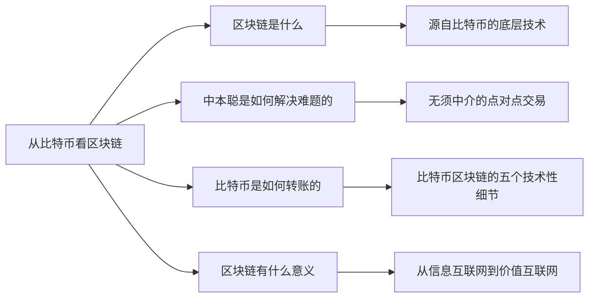

+++
title = "区块链超入门-1-区块链1.0从比特币看区块链-3.0冷知识"
date = "2021-05-02T10:10:10+08:00"
tags = ["区块链超入门"]
slug = "区块链超入门-1-区块链1.0从比特币看区块链-3.0冷知识"

+++

### 3.0 冷知识-比特币的UTXO

UTXO是unspent transaction outputs(未使用的交易输出)的缩写,每一个比特币其实都是UTXO,它是比特币的最核心概念之一。

> 注释：参考资料：《区块链：技术驱动金融》中相应的讨论，及文章“比特币和以太坊的记账方式——UTXO和账户余额”（黄世亮/文）。

#### 你的比特币就是UTXO

比特币的挖矿节点获得新区块的挖矿奖励，比如12.5个比特币，这时，它的钱包地址得到的就是一个UTXO，即这个新区块的币基交易（也称创币交易）的输出。币基交易是一个特殊的交易，它没有输入，只有输出。

当甲要把一笔比特币转给乙时，这个过程是把甲的钱包地址中之前的一个UTXO，用私钥进行签名，发送到乙的地址。这个过程是一个新的交易，而乙得到的是一个新的UTXO。

这就是为什么有人说在这个世界上根本没有比特币，只有UTXO，你的地址中的比特币是指没花掉的交易输出。

#### 详看从甲转账给乙的过程

假设甲（Alice）向乙（Bob）转账，则转账过程可以分为三个阶段（见图1-17）：

（1）假设Alice之前通过挖矿获得了12.5个比特币，在她的地址中，这些比特币是某个币基交易的UTXO。

（2）Alice发起一个交易，输入是自己的上一个交易，输出是Bob的地址，数量是12.5个比特币，Alice用自己的私钥对交易进行签名。

> 注释：这里简化了交易过程，只讨论了将上一个交易的输出全部转账的情况。如果试图转出上一个交易的输出的一部分，则要进行略复杂的处理。
>
> 按照比特币系统的设计，比特币交易还要遵循一个原则：每一次交易的输入值都必须全部花掉，不能只花掉部分。比如，我要转出比特币给你的钱包地址中只有8个比特币，那么很简单，我发起一个交易，把这8个比特币转到你的钱包地址中，我签名确认这个交易。
>
> 但假如我的钱包地址中有25个比特币，那我发起的交易就不是转给你8个比特币，然后自己的钱包地址中还剩下17个比特币。这时我发起的交易是：从我的钱包地址中转8个比特币给你，同时转17个比特币给我的同一地址。

图1-17 比特币转账的三个阶段

（3) 当交易被区块链确认后，Alice 的 UTXO 就变成了 0。而在Bob的地址中就多了一个 UTXO，数量是 12.5。

存在 Bob 的钱包地址中的这些比特币只有用 Bob 的私钥才可以签名转账给其他人。

如果Bob要将这些比特币转账给其他人，则重复上述过程。

简单地说，从一个地址向另一个地址转账比特币的过程，是用这个地址对应的私钥打开，再加密到另一个地址的过程。这个私钥的打开和加密就是签名的过程。在这个过程中，接收比特币的一方并不需要动用自己的私钥。

#### 我的比特币是什么样的？它们存在哪儿

初次接触比特币的人会问：我的比特币是什么样的？它们存在哪儿？

如果你头脑中参照的是在物理世界中购买金币，那么这里很不一样，你的比特币并不是存在家中或金库中，并不存在一个数字文件表示“你的比特币”。

如果你头脑中参照的是银行的存款，那么你可以假设，你的比特币就“存在”于一个账本上，我们已经知道了，在数字世界中，价值是账本中的“记录”。

不同的是，对比特币来说，这个账本不是一家银行的中心化数据库，比特币的账本是一个分布式账本，存在于一个去中心化的网络上。任何人都可以接入这个网络，把这个账本下载下来。但是，只有用你的私钥才能动用你的地址中的比特币。

我们还可以再换一个角度看，你的比特币在哪儿？按前面说的，比特币就是 UTXO，那么比特币可以被看成是上面的物理世界金币和银行存款两种概念的混合：

- 一方面，你的比特币是有一个“物理存在”的——对应着一个数据文件。比特币以一个交易的UTXO的形式存在着，每个交易都可被看成是一个数据文件。
- 另一方面，所有这些交易被打包进区块链的区块中，后一个区块连着前一个区块，形成一条链，也就是独特的账本。这么看，你的比特币是这个账本上的记录。

#### 为什么采用UTXO的形式

UTXO 与我们熟悉的账户概念的差别很大。我们日常接触最多的是账户，比如，我在银行开设一个账户，账户里的余额就是我的钱。

但在比特币网络中没有账户的概念，你可以有多个钱包地址，每个钱包地址中都有着多个 UTXO，你的钱是所有这些地址中的 UTXO 加起来的总和。

中本聪发明比特币的目标是创建一个点对点的电子现金，UTXO 的设计正可以看成是借鉴了现金的思路：我们可能在这个口袋里装点现金，在那个柜子角落里放点现金，在这种情况下不存在一个账户，你放在各处的现金加起来就是你所有的钱。

采用 UTXO 设计还有一个技术上的理由，这种特别的数据结构可以让双重花费更容易验证。对比一下：

- 如果采用账户和账户余额设计，Alice 要转账给 Bob，为了确保 Alice 的确有钱，我们需要核查她之前所有的交易。随着时间的推移，比特币的交易越来越多，这个验证的难度会持续上升。
- 采用 UTXO 设计，我们只要沿着每个交易的输入逐级向上核查，直到查到这笔比特币的创币交易即可。随着时间的推移，这个核查也会变难，但变难的速度要远低于采用账户和账户余额设计。

这种设计使得比特币系统作为一种电子现金系统有着非常大的可扩展性。当然，我们很快会看到，通常被认为是区块链 2.0 的以太坊没有继续采用 UTXO 设计，而是考虑到其他因素，采用了账户余额的设计，其代价正是中本聪可能已经考虑到的复杂性。