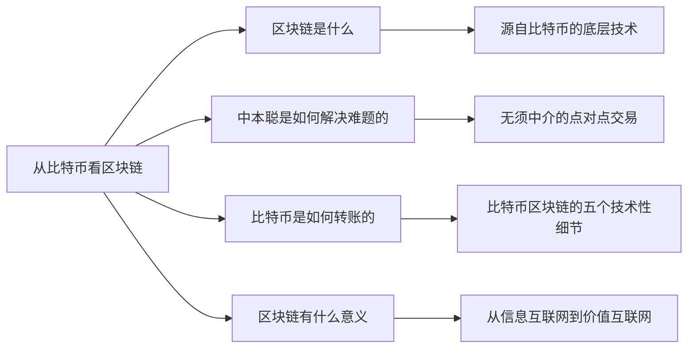

+++
title = "区块链超入门-1-区块链1.0从比特币看区块链-3.0比特币是如何转账的"
date = "2021-04-04T22:10:10+08:00"
tags = ["区块链超入门"]
slug = "区块链超入门-1-区块链1.0从比特币看区块链-3.0比特币是如何转账的"

+++

### 3.0 比特币是如何转账的——比特币区块链的五个技术性细节

“互联网上的商务交易，几乎都需要借助金融机构作为可信赖的第三方来处理电子支付。”比特币白皮书的第一句话这样写道。中本聪是如何把可信第三方从比特币的交易中去掉的呢？

通过两个人之间的转账交易，我们来看看比特币系统是如何实现交易的去中心化的？

假设我是甲，要把自己的钱包地址中的 8 个比特币转给你（乙），即转到你的钱包中去。详细讨论这一转账交易过程，我们可以看到比特币区块链是如何工作的五个技术性细节（见图 1-11）：

- 分布式账本和去中心网络
- 未使用的交易输出（unspent transaction output，UTXO）
- 比特币区块链的数据结构
- 工作量证明共识机制
- 比特币挖矿机制与代币生成机制

在沿着比特币系统所开创的路线开发各类基础公链时，开发者们从各个角度调整与改进以上五个技术性细节，形成新的区块链系统。

图1-11：一笔比特币转账交易的过程

如果希望先了解区块链全景,你可以先跳过这一节,在读完全书后再回来看这些重要的技术性细节.

#### 技术性细节之一: 分布式账本和去中心网络

所有的区块链系统都包括"分布式账本和去中心网络"这一对必备要素.

比特币网络没有一个中心服务器,它是由众多全节点和轻节点组成的,这些节点形成一个去中心网络.其中,全节点包含所有比特币区块链的区块数据,轻节点仅包括与自己相关的数据.比特币网络是完全开放的,任何服务器都可以接入、下载全部区块数据成为全节点。

所有用户持有的比特币信息都存放在一个分布式账本之中。这个账本是一个不断增长的由数据块组成的链条，这个数据块组成的链条是狭义的“区块链”。比特币账本可被认为同时存储在所有的全节点之中。

基于分布式账本与去中心网络，比特币系统实现了去中心化的价值表示和价值转移，它与中心化在线支付系统有很大的不同。

用两个人之间的转账来对比看一下。中心化在线支付系统的转账过程是：假设你我二人要通过支付宝进行转账。我们都在支付宝开设有账户（account），账户上有多少钱是支付宝账本上记录的数字。当我转账100元给你，支付宝在我的账户记录上减掉100元，在你的账户记录上增加100元，形成新的账本。到此，转账交易结束。

如图1 -12所示，中心化在线支付系统维护一个中心化的账本。用户在账本上开设账户，通过密码来与之交互。

对比而言，比特币系统使用的是一个分布式账本，用户在其中开设“账户”，严格地说是地址（address）。每个人都可以在比特币区块链上奖励“账户”，获得一对公钥与私钥，地址是公钥的哈希值，我们通过私钥与地址进行交互。

我们每个人有一个钱包，钱包种存储的是私钥。两个人在相互转账比特币时，可以通过各自的钱包软件直接进行。

在这里，比特币的去中心化体现在：不再有一个中心化机构来集中管理账本。账本存放在由众多节点组成的去中心网络中；不再有一个中心化机构来帮助我们管理账户、处理交易，每个人管理自己的钱包，交易由分布式账本来记录。

图 1-12 中心化在线支付系统 vs 比特币系统

有人会往下追问，我们地址中的比特币是记录在账本中的，看起来还是有一个“中心”存储我们的资产。其实，这个账本是分布式地存储在去中心网络中的，因而从这个层面看，它可以看成是去中心化的。

对比而言，对于中心化在线支付系统，它通常是由中心化的服务器来管理集中式账本。对于比特币系统，它背后的系统是一个去中心网络，网络节点共同维护一个分布式账本（见图 1 -13）.

图1-13 分布式账本与去中心网络

#### 技术性细节之二：UTXO（未使用的交易输出）

> 注释：更多的讨论详见本节后冷知识专栏“比特币的UTXO”。

在比特币系统上其实并不存在“账户”，而只有“地址”。只要你愿意，你就可以在比特币区块链上开设无限多个钱包地址，你拥有的比特币数量是你所有的钱包地址中比特币的总和。比特币系统并不会帮你把这些地址汇总起来形成你的账户。

从我（甲）到你（乙）的一笔比特币转账，是从我的一个钱包地址转到你的一个钱包地址上去。

接下来的讨论就涉及比特币系统的一个关键技术性细节：UTXO（未使用的交易输出）。通证经济专家孟岩曾撰写一篇文章，标题是“其实没有什么比特币，只有UTXO”，这个标题指出了，对于计算机来说比特币是什么——比特币是区块链账本上的交易输出。

我们来看一个两个人进行转账交易的过程，以深入理解UTXO：

假设我有8个比特币，这其实意味着，之前有一个交易把这些比特币转入我的地址，这个交易的输出（即8个比特币）未被使用，我拥有了这8个比特币。

现在，我要发起一个转账交易，这个交易中的输入是让我拥有这些比特币的上一个交易。

我要转账给你，我做的是，对让我拥有这些8个比特币的上一个交易进行签名，把这一新转账交易的输出地址设为你的钱包地址。

这样，我就发起了一个转账支付交易。等矿工将这一交易打包进新的区块，转账交易完成，这8个比特币就属于你了。你拥有的是你我这个交易的未使用的交易输出。

对于一个交易签名所涉及的比特币的公钥和私钥的非对称加密机制，之后再讨论。为便于理解可类比看，钱包地址相当于房间号和锁，私钥则相当于钥匙，钥匙可以打开对应的锁。

以上两个人的转账交易过程是：我用私钥（从一个输出是我的地址的交易中）取出比特币，并用私钥对从我的地址转到你的地址的新交易进行签名。一旦交易完成，这些比特币就赚到你的钱包地址中去。你的钱包中新交易的未使用交易输出，只有你的私钥才可以打开。

从以上的讨论中我们可以看到，的确不存在比特币，只有未使用的交易输出（UTXO）。每一笔比特币都源自上一个交易，可以一直向上追溯上去。而一直向上追溯，在每一笔比特币的源头，都有一种特殊的交易，即比特币矿工因挖矿获得奖励的创币交易，每一个比特币都是通过挖矿被创造出来的。假设我作为比特币矿工挖矿成功赢得了25个比特币，那么这个特殊交易是，它的输入是0，而输出是25个比特币进到矿工的钱包地址中。

未使用的交易输出（UTXO）和我们熟悉的银行账户有着很大的不同。为什么要采用这样的设计？对比银行账户和比特币的UTXO，我们可以看到UTXO的优点。

第一，UTXO设计易于确认比特币的所有权。

如果采用传统的账户设计，当我要转账8个比特币出去时，为了完全避免造假，我们就需要逐一向上追溯，确认之前的每一笔交易，从而证明我的确拥有8个比特币。

采用现在的UTXO设计，要确认我有8个比特币，只要确认上一个交易我的确获得了它们即可。通常只要上一个交易是真实的，我就的确拥有这些比特币。而我们知道，一个区块经过6次确认，其中的交易可被认为是真实无误的。

第二，UTXO设计与区块链账本是完全融为一体的。

区块链账本存储的是状态。以太坊是对比特币区块链的改进，在白皮书中，以太坊创始人维塔利克分析了比特币，他认为，“比特币账本可以被认为是一个状态转换系统（state transaction system）”。以太坊也是采用这种状态转换系统的设计，但对之进行了改进。

> 注释：微观地看，每一个区块链中的交易都是一个状态转换函数，以太坊白皮书就用“以太坊状态转换函数”（Ethereum state transaction function）来讨论在区块链上一个交易的进行过程。

几乎所有的区块链都是采用这一设计，每一个新区块和它之前的所有区块一起形成了一个新的状态，如此重复、持续下去。在确认之后，之前的状态就不可篡改，即不可随意更改。UTXO（未使用的交易输出）是与这种状态的设计相对应的。

#### 技术性细节之三：比特币区块链的数据结构

我们回到两个人转账交易的过程中，去理解比特币区块链的数据结构。

我发起一笔交易，即我向整个区块链网络广播，我和你两个人想进行这笔交易：我向你的地址中转入一笔比特币，无须你的许可。

但只有当这笔交易被打包进最新的比特币区块中时，这笔交易才真正完成。通常来说，当在一笔交易所在的区块之后又增加5个区块，即包括它自己在内一共经过6次确认时，这笔交易可认为被完全确认。按比特币每个区块的确认时间10分钟估算，即一笔交易最终确认要经过1小时。

这里包括了两步：一是交易被打包进候选区块，每个节点可以按规则生成不同的候选区块；二是节点挖矿成功，候选区块被成功地加到区块链的尾部，称为最新的正式区块。

那么，把一笔交易打包进区块是什么意思呢？这涉及区块链最基础的数据结构，这也是它不可篡改的基础。

以下讨论可能略显枯燥，但却是认识比特币与区块链的最基础的知识，我尽量以通俗的语言来解释。

区块链之所以被称为blockchain，是因为它的数据块以链状的形式存储着。从第一个区块即所谓的创世区块开始，新增的区块不断地被连到上一个区块的后面，形成一条链条。

每个区块由两个部分组成——区块头部和区块数据。其中，区块头部中有一个哈希指针指向上一个区块，这个哈希指针包含前一个数据块的哈希值。哈希值可以被看成是数据块的指纹。如果上一个区块中的数据被篡改了，那么数据和指纹就对不上号，篡改行为就被发现了。要改变一个区块中的数据，对其后的每个区块都必须相应地进行修改。

> 注释：比特币区块链设计有一种机制让这种修改难以发生，我们稍后在谈到“工作量证明”和“比特币挖矿”时再详细讨论。
>
> 可通过如下网站查看比特币区块链的数据信息：https://blockchain.info/。

一个区块中的数据是被打包进这个区块的一系列交易。这些交易按照规定的规则被打包形成特定的二叉树数据结构——梅克尔树（Merkle trees）。按目前的比特币区块的大小，一个区块中能容纳的交易数量在2000个左右，比如在第526 957个区块中容纳了1804个交易。

比特币区块链的数据结构中包括两种哈希指针,它们均是不可篡改特性的数据结构基础.一个是形成"区块 + 链(block + chain)"的链状数据结构,另一个是哈希指针形成的梅克尔树(见图1-14)。链状数据结构使得对某一区块内的数据的修改很容易被发现；梅克尔树的结构起类似作用，使得对其中的任何交易数据的修改很容易被发现。

图1-14 比特币区块链的“区块链”与梅克尔树

#### 技术性细节之四：工作量证明共识机制

比特币的去中心网络采用的是工作量证明共识机制。去中心网络之所以需要共识机制，是因为这是一个非基于信任（non-trust-based）的网络，任何人无须许可都可以接入这个网络。并且，这些节点分散在网络条件差异非常大的全球互联网之中。在完全无中心的情况下，这些节点要同步一致，共识机制即为这些节点达成一致的机制。

关于分布式网络的共识机制，有著名的“Fisher-Lynch-Paterson 不可能结果”，即在一定条件下达成共识是不可能的。而比特币的工作量证明共识机制在实践中被验证是有效的。这是因为它采用了一个实用主义的解决方案。

比特币的工作量证明的关键特点是，它巧妙地融合技术和经济因素，不只是纯粹通过技术本身来达到这一点，而是纳入了与自身作为一个数字现金系统相关的挖矿奖励。按《比特币：技术驱动金融》一书的分析，比特币的共识机制有两个与过去不同的特点，我们略做引申讨论：

第一，它引入了奖励机制，在这样一个加密数字货币应用中引入了经济激励，维护网络的节点就可以得到有价值的比特币作为奖励。

为什么比特币网络中的节点们愿意打包交易、维护账本？它们并非出于“善意”，而是因为，它们能因这些挖矿行为获得比特币形式的经济激励。这是一个自行发行的电子现金系统的独特优势，如果所开发的是其他没有自行发行代币的IT系统，我们就无法设计矿工挖矿奖励这样的经济激励机制。

激励挖矿节点参与挖矿的，除了与新区块相关的奖励之外，挖矿节点还可以得到区块中包含的所有交易付出的交易费。但到目前为止这个数值还较小，大概为新区块奖励的1%。

第二，它包含了随机性的概念。比特币系统形成的共识不是完全可靠的，但是在等待了6个区块约1个小时之后，出问题的概率呈指数级下降。在6个区块之后，一个交易发生双花情况的概率可被认为是零。从纯理论上看，完美的共识不可能达成，但从使用的角度看，这个共识是可信的。

#### 技术性细节之五：比特币挖矿机制——代币生成机制

挖矿节点计算机在挖矿时要做两个任务。第一个任务是把比特币网络中未确认的交易按梅克尔树组装成候选区块，未被纳入的交易则往下顺延。在创建候选区块时，除了普通的交易之外，矿工在其中增加一个特殊的交易：币基交易（coinbase transaction）。如果挖矿成功，则币基交易会凭空转出新区块的奖励比特币到矿工的钱包地址中，从而发行这些比特币出来。这个特殊交易也被叫作“创币交易”，新的比特币是在这一交易中被创造出来的。

挖矿节点计算机的第二个任务是真正的挖矿，即进行加密哈希计算，解决一个计算难题，进行算力竞争。在众多争夺记账权的节点中，谁最先完成这个计算，它打包的区块就被加到了区块链的最后，成为最新的区块。率先完成计算的矿工会赢得新区块的挖矿奖励。最初，成功挖出一个区块，矿工可以获得50个比特币的奖励，按规则，这个挖矿奖励每四年减半一次，分别为25个、12.5个，以此类推。

我们再讨论两个问题，以深入了解比特币的工作量证明共识机制与它的挖矿机制。

第一，先向内看，比特币矿工挖矿是在做什么？

在候选区块的头部有一个32位的随机数区域，矿工需要反复调整随机数并计算，目标是让整个区块的哈希值小于一个“目标值”。如果试过所有的32位随机数可能性后，计算仍未能成功，那么就要改变币基（coinbase）的一个随机数，接着进行反复计算。

这个计算是加密哈希计算（对比特币来说是SHA-256），除了反复计算别无他法。这个计算量非常大，比如在2015年年底，在大约2的68次方个随机数中，只有一个可以成功，这个数字比全球总人口的平方还要大。

有意思的是，这种挖矿计算是非对称的，你挖矿需要经过2的68次方个哈希计算，而我要验证你的确找到有效的随机数，只需要一次就可以了。

第一个完成这个计算难题的节点所打包的区块就成为有效区块，它向全网广播告知自己已经完成，由其他节点确认后（即有别的挖矿节点在这个区块的基础上进行下一个区块的挖矿，生成新的区块）。在等待6个区块后，该挖矿节点就可以获得这次比特币奖励。

比特币的去中心网络能够长期运行下来，现在有1万多个全节点，正是因为有这样的挖矿奖励机制。出于对自己的利益考虑的矿工运维着这个不属于任何人、完全去中心化的网络。

第二，再向外看，比特币的挖矿机制在加入挖矿的计算机的算力不断增加的情况下，这个挖矿机制是如何保持稳定的？

比特币挖矿的芯片已经经过几轮演变，其计算能力越来越强：从CPU演变到GPU（显卡），再到现场可编程门阵列（FPGA），再到现在的专用集成电路技术（ASIC），即只能进行比特币挖矿所需的哈希计算的专用芯片中。并且随着矿机的升级迭代和数量增多，接入比特币区块链网络、参与挖矿竞争的计算算力越来越大。

相应地，比特币系统有这样一个对应的机制设计：随着算力的增长，调整目标值的难度使得挖出一个区块的时间始终是10分钟左右。

这形成了一种动态的平衡，维持区块链网络经济激励的有效与稳定。这个决定难度的公式非常简单明了，每挖出2016个区块，也就是经过约两个星期，挖矿难度会进行一次调整，该公式是：

下一个难度 = 上一个难度 * 2016 * 10 分钟 / 产生2016个区块所需的时间

如果算力突然大幅度上升，产生上一组2016个区块所需的时间变短，那么难度就会上升。在某些特殊情况下，如果产生上一组2016个区块所需的时间变长，那么难度也会下降，但这样的情况并不多见。

因此，比特币矿工节点的挖矿是它在运行分布式账本与去中心网络。同样重要的是，它也是比特币的发行机制和整个社区的激励机制。

比特币的挖矿是比特币的唯一发行机制，从中本聪挖出第一个区块获得50枚比特币开始，比特币这个加密数字货币就以这样的去中心化方式不断地发行了出来。

比特币区块链网络是由众多节点组成的去中心网络，而这些计算机节点加入这个网络，维护分布式账本，是因为中本聪在设计系统时巧妙地加入了经济激励：众多比特币矿工（即挖矿节点）在竞争获得记账的权利，矿工每增加一个新的区块能获得对应的记账奖励。

比特币的经济系统是以“竞争-记账-奖励”循环为核心的（见图1-15），其中“竞争”非常重要，即挖矿节点进行的算力竞争。在比特币系统这样一个去中心网络中，节点参与是出于获得经济奖励的自利动机，而记账权力和对应的奖励需要通过竞争来获得。

> 注释：在区块链的相关探讨中，有把“挖矿”一词的含义扩大的倾向，在这里我们认为，只有生成区块的计算行为，即运维分布式账本与去中心网络的行为，才是真正意义上的挖矿。简单地说，只有生产区块，才是挖矿。
>
> 即便放宽要求，不再强求只有计算机节点生产区块才是挖矿，我们也仍想强调，竞争获得对应的权利和奖励仍是必须的。没有竞争的奖励，是很难真实有效的。

通过讨论比特币区块链的五个技术性细节，我们再一次看到，比特币系统在发行和交易层面都实现了完全的去中心化：

* 一个交易的确认，被写入分布式账本记录下来，是由去中心网络中互不信任的节点为了自己的利益相互以算力进行竞争而确认的。

图1-15 比特币的“竞争-记账-奖励”循环

* 在竞争挖矿的过程中，比特币的发行是“凭空发行货币”，它的货币发行也是靠这个去中心网络的算力竞争来完成的，是去中心化的。

比特币作为区块链1.0的典型，完成了价值表示和价值转移的概念验证（见图1-16）。

比特币区块链是非常精妙的设计，它无须任何人的居中协调与领导就能持续发展。比特币可能是迄今为止最成功的加密数字货币，比特币区块链在加密数字货币的应用上堪称完美。

比特币区块链即“区块链1.0”是专为去中心化的电子现金设计的，而要在各个领域中广泛应用，我们需要有更通用、性能更好的区块链系统。

在比特币系统之后出现了常被认为是“区块链2.0”代表的以太坊。现在更多项目在竞争成为“区块链3.0”，我们在之后两章会分别讨论它们。

但在讨论区块链2.0、区块链3.0之前，我们先讨论区块链为什么重要？在下一节中，我们讨论区块链给互联网和数字世界带来了什么巨变？