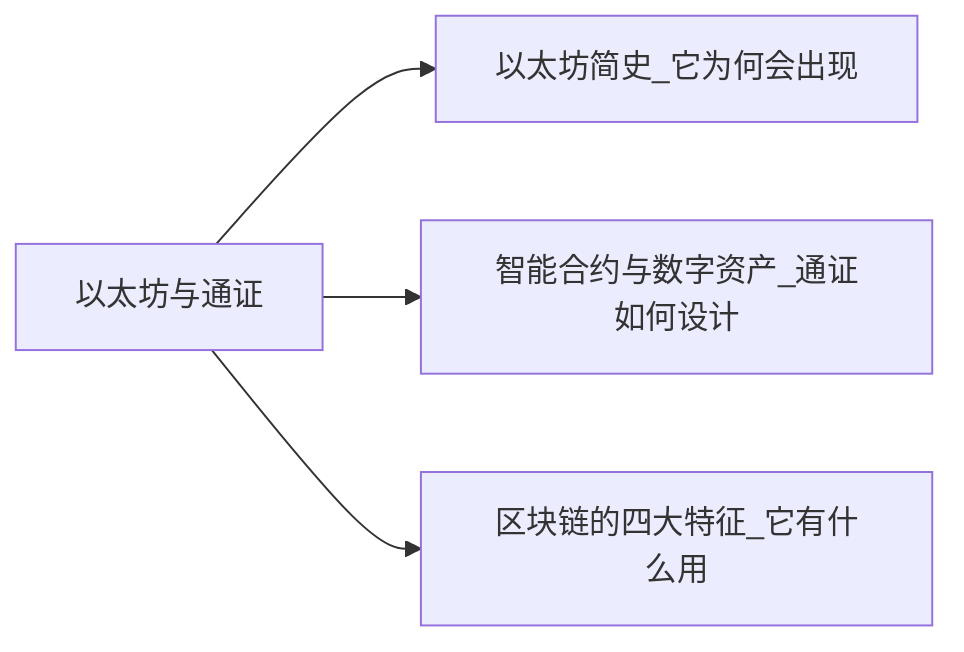

+++
title = "区块链超入门-2-区块链2.0以太坊与通证-1.0冷知识3"
date = "2021-05-02T15:40:10+08:00"
tags = ["区块链超入门"]
slug = "区块链超入门-2-区块链2.0以太坊与通证-1.0冷知识3"

+++

### 1.0 冷知识3:维塔利克说以太坊的Token系统

以太坊的重要应用是在它上面用智能合约发行通证。在白皮书中，维塔利克详细地讨论了所谓的“Token 系统”。

他的讨论可以引导我们去思考：在区块链上，通证可以表示何种价值或资产？如何用通证来表示资产？以及用通证表示资产后如何形成应用系统？

以下是维塔利克在以太坊白皮书中的讨论。为了与一般性的“通证”说法区分，这里引述的中文翻译中称 token 为“令牌”。

#### 令牌系统（token systems）

链上令牌系统有很多应用，从代表美元或黄金等资产的子货币到公司股票，代表智能资产的单独令牌，安全的、不可伪造的优惠券，甚至与传统价值完全没有关联的令牌系统，如积分奖励。

在以太坊中实施令牌系统非常容易。关键的一点是理解，所有的货币或者令牌系统从根本上来说都是带有如下操作的数据库：从A中减去X单位并把X单位加到B上。前提条件是：

1. A在交易之前有至少X单位；
2. 交易被A批准。

实施一个令牌系统，是把这样一个逻辑实施到一个合约中去。

区块链能方便地承载Token系统，是源于它特殊的存储机制——它存储的是状态。我们熟悉的数据库存储的不是状态，数据库的记录可以反复修改；而区块链中存储的是状态，也就是某一时刻所保存的信息。

在《商业区块链》一书中，区块链专家威廉·穆贾雅提出了一个可以用Token系统表示的事物的分类。他把区块链中可存储的事物的首字母组成了一个单词“ATOMIC”：

- 可编程的资产（assets）。
- 可编程的信任（trust）。
- 可编程的所有权（ownership）。
- 可编程的货币（money）。
- 可编程的身份（identity）。
- 可编程的合同（contracts）。

> 英文原文:On-blockchain token systems have many applications ranging from sub-currencies representing assets such as USD or gold to company stocks,individual tokens representing smart property,secure unforgeable coupons,and even token systems with no ties to conventional value at all,used as point systems for incentivization.Token systems are surprisingly easy to implement in Ethereum.The key point to understand is that all a currency,or token system,fundamentally is a database with one operation:sub-tract X units from A and give X units to B,with the provision that(1) A had at least X units before the transaction and (2) the transaction is approved by A.All that it takes to implement a token system is to implement this logic into a contract.

###　专题讨论－机器比人更需要通证

在讨论数字世界中表示价值的通证时，我们常会拿它和法定货币做比较，这会带来一个疑问：在很多情况下，延续数千年的人类货币已经工作得很好，在数字世界中，在线支付系统也工作得很好。至于它们是中心化还是去中心化的，对用户来说并不那么重要。那么，为什么我们还需要通证？

我们可以从很多个角度来探讨这个话题，其中一个可能很重要的观点是，机器比人更需要通证。

#### 通证有什么用

如图 2-10 所示，我们可以用两个维度把自己所处的世界分成几个部分，一个维度是区分数字世界和物理世界；另一个维度是区分信息互联网和价值互联网。我们在这里把所有线下资产都视为一类，为第三类 ③。

图2-10：从四个象限看通证的用途

我们可借用这张图示来思考“通证有什么用”这个问题。

通证的作用是，在数字世界中，在区块链上表示价值。比特币、以太币等是凭空在区块链上发行出来的。

要把其他象限的价值映射到链上、用通证来表示，主要有两个路径：

- 路径之一是，把原本在互联网上通过中心化机构的数据库表示的价值和价值转移，切换到去中心化的区块链上来。比如常见的有网络零售的支付、社交网络的积分、游戏里的道具等，反映在图中就是从象限 ② 到象限 ③。
- 路径之二是，把实体中的资产映射到链上，通过区块链进行流通。比如常见的有：把线下的民宿、供应链金融、资产证券化（ABS）中的资产用通证进行表示，反映在图中就是从象限 ③ 到象限 ①。

这两个都是值得探索的方向，但在这两个方向上探索时，我们逐渐地感到困惑：通证除了可以更大范围地进行交易，似乎并没有带来多少独特优势。对于路径一，互联网上的各类点卡、积分、道具一直运作良好；对于路径二，用通证进行表示依然没有能解决线下资产如何数字化的问题，也没有解决它们的流通性问题。

问题可能出在，把线上、线下资产变成链上资产，用通证进行表示，通过自由市场交易来发现其价格，这只是表面的变化。当我们意识到自己还在把它们折算为法币值多少钱时，我们发现，传统的法币在代表这类价值时已经做得足够好。

在如上这些领域中，用法币来表示这些价值以及相关的金融工具都非常成熟。把线下、线上资产用通证进行表示，可以带来一些优势，比如，过去在互联网上一个点赞 0.0001 美元的行为也许就被忽略了，而现在可能被通证记录下来了。但是，这带来的变化还是不那么大。出现这样的困惑是因为，我们始终站在人的视角来看通证的可能性，而通证能发挥作用的地方应当是法币不那么有效的地方。

#### 当我们不再站在人的视角

当站到机器的视角去看通证时，我们会发现通证的独特价值，它的角色是法币无法替代的。

token 这个词在网络通信中的原始含义是令牌，只有有令牌的节点才能参与通信，令牌代表权利。当数字世界的范围扩大，在看机器相互交互的场景时，我们会看到，它们比人类更需要通证。

来看一种场景，在讨论中我们暂用 token 而不是通证。

假设，为了防止网络中的机器发出垃圾邮件，我们设定如下规则：个人电脑或手机在发出邮件时，需要消耗一个 token；发件邮件服务器也要消耗一个 token。如果这个邮件不被垃圾邮件规则拦截，或不被个人举报为垃圾邮件，那么在一定时间内，所消耗的 token 又会回到我们手中。

在这个过程中实际发生的是 token 的抵押，从而确保我们行为的正当性。系统可以预先给各个邮件账号和邮件服务器分配适量的 token，这样我们正常发送邮件就不会受到影响。对于那些需要大量发送推广邮件的人而言，他们发送的邮件有一定可能被认为是垃圾邮件，他们就需要用法币换取一定的 token，否则他们可能因为 token 数量为零而无法再发送邮件。

要让这样一个使用 token 的反垃圾邮件系统投入运营，我们的设计肯定不应是每个电脑、手机、服务器都需要存入法币，以购买 token，那只是特殊情况。我们的设计可能是，让这些机器可以自行以某种方式获取 token，比如这些计算机可以完成什么计算任务以获得 token。

从这样一个简单的例子中可以看到，机器在交互时比我们更需要 token。

放到物联网的场景中，每个传感器在和其他机器进行交互时，可能获得 token 或消耗 token。我们的做法也不应是给每个传感器开设一个和法币对应的账户。这时，我们应该设计机器专用的钱包和 token。

随着越来越多的物联网设备接入网络，我们需要有各种不同的机器 token。

在多数情况下，机器用自己类型的 token 就足够了。只有在极少数情况下，我们才需要根据一定的汇率，让这些 token 与其他数字货币进行转换，让它与法币进行转换。兑换并不频繁，转换的汇率也并不特别重要。

因此，当转换到机器视角时我们看到：在人的世界里，通证有意义，但不够大；在机器的世界里，通证不可或缺（见图2-11）。机器比我们人类更需要通证。机器如何使用通证，将可能是区块链和通证应用的主要探索方向之一。

图2－11：机器的世界 VS 人的世界

　