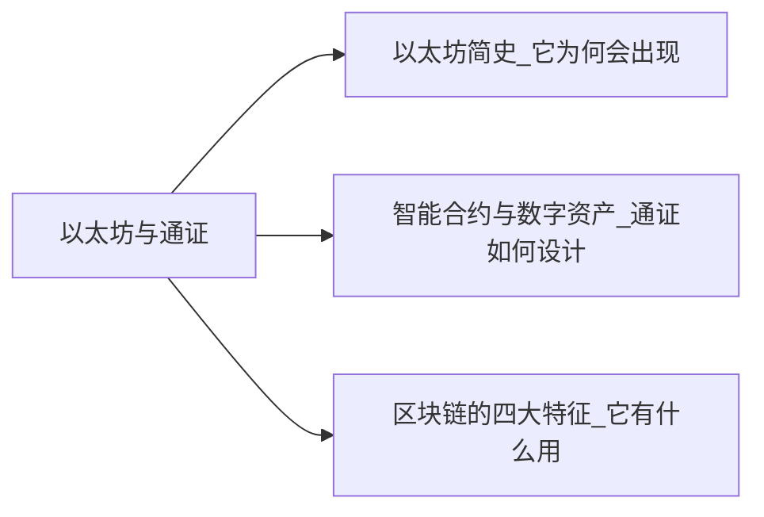

+++
title = "区块链超入门-2-区块链2.0以太坊与通证-2.0专题讨论"
date = "2021-05-02T17:20:10+08:00"
tags = ["区块链超入门"]
slug = "区块链超入门-2-区块链2.0以太坊与通证-2.0专题讨论"

+++

### 2.0专题讨论-通证的分类:实用型 vs 证券型

通证是全新的事物，目前人们对于通证的分类仍未达成共识。这里将所见的各种分类列举如下，供你参考。

瑞士金融市场监管局（FINMA）将通证分成以下三种：

- 支付类通证（payment）。
- 实用类通证（utility）。
- 资产类通证（asset）。

其中，资产类通证可视为“证券类”（security），有时，实用类也被翻译成“功能类”。

按美国 SEC 的分类方式，通证被分成属于证券与不属于证券两类。SEC 通常用“Howey Test”来判定某一金融工具是否为“投资合同”进而构成“证券”，“Howey Test”包含了四要素：

- 资本投入；
- 投资于一个共同事业；
- 期待获取利润；
- 不直接参与经营，仅仅凭借发起人或第三方的努力。

在一次分享中，知名区块链专家、万向区块链董事长肖风将通证分为功能类、证券类和基金类。也有人从产业的角度将通证分为基础公有链、行业生态类、公司证券类。

通证宝创始人王玮将通证按有发行人和无发行人分成两大类。

- 有发行人的三种是：价值型、收益型、权利型；
- 无发行人的一种是：计算型。计算型是一个有意思的说法，这一名称表明诸如比特币、以太币等都是基于数学计算产生的。

现在通常认为，比特币、以太币等是接近于瑞士金融市场监管局中的支付类型通证分类。除此之外的通证可以按美国 SEC 分类（证券与非证券）延展进行分类。

在 2018 年 7 月的一个分类中，奥黛丽·奈斯比（Audrey Nesbitt）将通证分为两大类、四小类，我认为，这可能是易于在实际项目的通证模型设计中使用的一种分类（见图2-18）。其中，两大类之间要进行相对严格的区分，但小类间不必进行明确的区分，她的分类如下：

> 资料来源:To Be or Not to Be a Utility or a Security Token,Audrey Nesbitt(2018年7月10日)。

- 第一大类：实用型通证（utility to ken）。
  - 产品或服务通证（use of product），代表公司的产品或服务的使用权。
  - 奖励通证（reward token），用户通过自己的行为获得奖励。
- 第二大类：证券型通证（security token）。
  - 权益通证（equity token），类似公司的股权、债券等。
  - 资产通证（asset token），对应实体世界中的资产，如不动产、黄金等。

图2-18：通证的一种分类

当前市场中交易的通证，多数属于权益通证，但为了不受到当前各国法规中对证券的严格监管的影响，又往往通过各种设计将自己设计为实用型通证。

在相关通证设计中，最为独特的案例是 EOS币，它是由 Block.one 公司发行的，但它被定义为“商品售卖”，而非公司“权益”。并且特别地，公司又通过免责条款免除了 EOS 币任何和实用性相关的特性。比如，EOS 的相关条款说：EOS 币没有明示或暗示的权利、用途、目的、属性、功能或特征。

> 原文： EOS TOKENS HAVE NO RIGHTS,USES OR ATTRIBUTES.The EOS Tokens do not have any rights,uses,purpose,attributes,functionalities or features,express or implied,including,without limitation,any uses,purpose,attributes,functionalities or features on the EOS Platform.Company does not guarantee and is not representing in any way to Buyer that the EOS Tokens have any rights,uses,purpose,attributes,functionalities or features.

