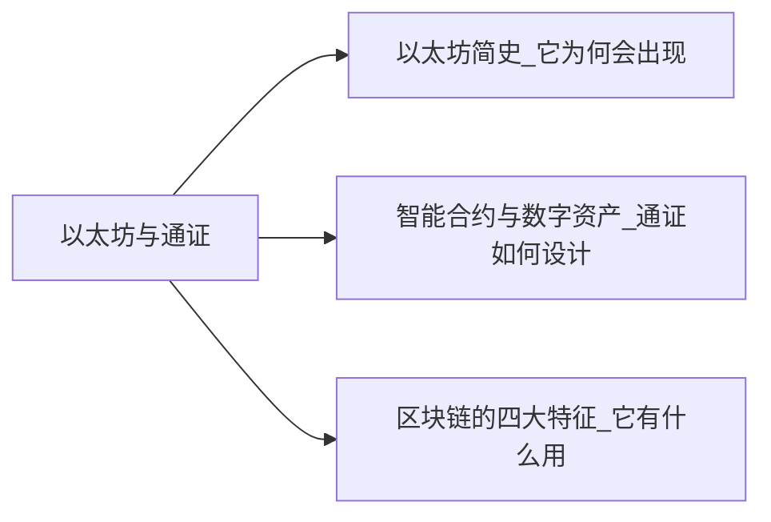

+++
title = "区块链超入门-2-区块链2.0以太坊与通证-2.0冷知识"
date = "2021-05-02T17:30:10+08:00"
tags = ["区块链超入门"]
slug = "区块链超入门-2-区块链2.0以太坊与通证-2.0冷知识"

+++

### 2.0冷知识1-以太坊智能合约的技术与组件

要在以太坊上编写一个智能合约，所涉及的技术和组件有：

- Solidity，以太坊的图灵完备编程语言，用于编写智能合约。
- 虚拟机（Ethereum Virtual Machine，EVM），即智能合约运营的环境。
- 预言机（Oracle），用于链上和链下数据信息的交换。
- Web3.js，与以太坊区块链节点进行交互的JavaScript API。

常见的以太坊通证标准有两种：

- ERC20标准，可互换通证。
- ERC721标准，不可互换通证。

2014 年 12 月 31 日，维塔利克曾画了一张名为“Silos”的图，展示了他理解的以太坊架构（见图2-24），从下而上分别是：共识、经济、链上与链下服务、互操作、浏览器、分布式应用（DAPPs）。

一般来说，以太坊的体系架构可分为六层，与比特币系统对比，它的重要特点是把合约层从共识机制中分离出来（见图2-25）。

图2-24：2014年版的以太坊架构（维塔利克绘制）

图2-25：以太坊的体系架构

### 冷知识2-ERC721标准与加密猫

2017 年 11 月 28 日，“加密猫”游戏出现在互联网上。这是基于以太坊的 ERC721 标准（不可互换通证）发行的加密数字宠物，每一只猫咪各不相同。

加密猫的正式中文名叫“谜恋猫”，游戏的官网称这些加密猫是“可收藏、可繁殖、讨人喜欢的”。用户可以用以太币换购这种猫咪。这个简单的游戏吸引了大量的用户，甚至使得以太坊区块链网络出现了大拥堵。

在此之前，人们对以太坊的认识是，它的主要应用是用它的智能合约发行符合 ERC20标准的可互换通证，同一种通证的一枚和另一枚是完全一样的。

对比而言，基于 ERC721 的这种加密猫的每一只都是独一无二的。加密猫极大地扩展了以太坊的通证用途。有不少分析文章讨论了加密猫的意义，在一篇文章中，作者萨曼莎（Samantha Radocchia）用电子邮件做类比说：我认为在互联网的早期，没人想到它会变成今天的样子。我们那时仍在试图弄清楚如何使用互联网。然后，E-mail 出现了。突然间，这个非常强大而重要的工具改变了人们对互联网的看法。我记得爸爸在我的小时候给我看家里发的电子邮件时，我们都很惊讶。你可以立即给世界各地的人发送一张数字便条。

……

我们知道（区块链）这项技术有着不可思议的潜力，但我们还无法把握所有的可能性。但像加密猫这样的应用帮助增长了用户基础，增加了我们对于什么是可能的理解。”

加密猫的关键信息如下：

- 加密猫是一种非替代性代币，它是不可分割且独一无二的。
- 智能合约拥有 40 亿种表型性变体（你可以看到）和基因型（你无法看到）。
- 加密猫的架构在以太坊网络之上，加密猫的购买和育种都需要用到以太币。
- 两只加密猫可以繁殖一只全新的后代。

> 资料来源：https://www.cryptokitties.co/Technical-details.

### 冷知识3-以太坊的账户

以太坊是有账户的，每个用户都可以开设账户，账户余额是我们拥有的以太币或其他基于 ERC20标准的通证。账户的设计使得以太坊与比特币不同，根据之前的讨论我们知道，比特币只有钱包地址和未使用的交易输出。

#### 两种账户：外部账户和合约账户

以太坊有两种账户，如图2-26所示：

- 外部账户（externally owned accounts），由密钥控制。
- 合约账户（contract accounts），由智能合约的代码控制。

图2-26：以太坊的两种账户

以太坊的账户包括四个字段：一个随机数、账户的余额、合约代码（如果有的话）、存储（通常为空）。

只有合约账户才有代码，其中存储的是 codeHash（这个账户的以太坊虚拟机代码的哈希值）。这个字段在生成后是不可修改的，这意味着智能合约代码是不可修改的。

外部账户可以触发交易，而合约账户不能主动发起交易，只能在被触发后按预先编写的智能合约代码执行。

合约账户可以设置多重签名（multisign），比如一个简单示例是：现有一个合约账户，它要求一个转账由发起转账的人（Alice）和另一个人（Charles）签名均可。因此，当 Alice 通过这个合约向 Bob 转账 20 个 ETH 时，合约会通知 Charles 签名，在他签名后，Bob 才可以收到这 20 个 ETH（见图2-27）。

图2-27：以太坊合约账户的多重签名

#### 以太坊的交易和它的区块中存的是什么

和比特币一样，以太坊的区块中存储的也是交易（transaction），它包括的字段主要有：接受者（接受的账户）、发送者的签名、发送者发给接受者的以太币金额等。

与比特币的区块中存储的是交易不同，以太坊的区块中以梅克尔帕特里夏树（Merkle Patricia Tree,MPT）形式存储的是相应的以太坊账户的状态。

以太坊的交易是所谓的状态转换函数，一个交易触发它的执行，它将相应的账户从一个状态转变成新状态，然后新状态被存储在区块链的数据区块中。

> 参考资料：https://github.com/ethereum/wiki/wiki/White-Paper#ethereum-accounts.

