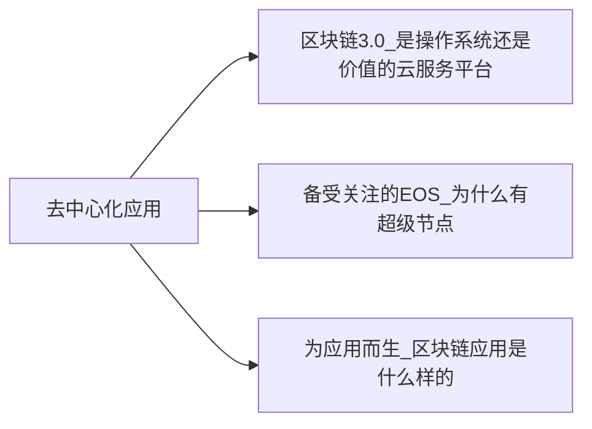

+++
title = "区块链超入门-3-区块链3.0去中心化应用-2.0冷知识"
date = "2021-05-02T19:30:10+08:00"
tags = ["区块链超入门"]
slug = "区块链超入门-3-区块链3.0去中心化应用-2.0冷知识"

+++

### 2.0 冷知识1-EOS的共识机制与区块生成

在《EOSIO 技术白皮书》中，对 EOS 的共识机制 BFT-DPOS（拜占庭容错算法+权益委托共识机制）进行了说明。其中拜占庭容错算法（Byzantin eFault Tolerance）的用途是：

所有的出块者都要对所有区块签名，以确保在同一时间戳或者同一区块高度上，没有区块生产者能够同时在两个区块上签名。一旦一个区块有了 15 个区块生产者的签名，该区块就被认为是不可逆的。任一区块生产者如果想在同一时间戳或者同一区块高度的两个区块上签名，就会留下密码学证据。在这一模式下，一秒之内就可以达成不可逆的共识。

在白皮书中，EOS 对其区块的出块机制进行了介绍，转摘如下：

根据这一算法，在使用 EOSIO 软件构建的区块链上持有通证的人，可以通过一个持续进行的投票系统来选择区块生产者。任何人都可以选择参加区块生产，只要能够说服通证持有人为其投票，就会有机会参与区块的生产。

EOSIO 软件可以让区块每 0.5 秒生成一个。在任何时刻，只有一个生产者被授权生产区块。如果在计划的某个时间内没有成功出块，则跳过该块。如果有一个或更多的区块被跳过，则在区块链上会有 0.5 秒或者更久的空白。

使用 EOSIO 软件，区块的产生以 126 个区块（每个出块者六个区块，乘以 21 个出块者）为一个周期。在每个出块周期开始时，软件会根据通证持有人所投票数选出 21 个区块生产者。被选中的区块生产者的出块顺序要获得 15 个及以上的区块生产者的同意。

如果出块者错过了一个块，并且在最近 24 小时内没有产生任何块，则这个出块者将被剔除在考虑范围之外，直到他们通知区块链可以重新开始产生区块。这确保了网络的顺利运行，把被证明为不可靠的区块生产者排除在出块排序之外，这一方式使得错过区块的数量最小化。

资料来源：

- 中文译文摘自：http://blog.eosdata.io/index.php/2018/04/28/eos-io-whitepaper-v2/
- 英文版见：https://github.com/EOSIO/Documentation/blob/master/TechnicalWhitePaper.md

### 2.0 冷知识2-关于EOS的主要开发者 BM

EOS的主要开发者是区块链的传奇人物丹尼尔·拉瑞莫（Daniel Larimer），他的网名为 ByteMaster，在网上他也被称为 BM。BM 个人参与创建了三个主要的区块链公链项目，EOS 是第三个，如图3-10所示。

图3-10：丹尼尔·拉瑞莫开发了三个主要区块链项目与一个共识机制

BM 开发的第一个主要区块链项目是比特股（Bitshares X，BTS），这个项目创建了一个去中心化的银行和交易所，使用区块链账本来创造可互换数字资产，这些资产可以市场化锚定美元、黄金、汽油等任何东西的价值。

这个区块链的共识机制正是所谓的 DPOS 共识机制（https://bitshares.org/technology/delegated-proof-of-stake-consensus/）。DPOS 是 BM 于 2013 年 12 月 8 日提出的，在同年的 7 月他已经利用这一共识机制开发了比特股。比比特股的DPOS共识机制被抽象成了石墨烯（graphene）框架，在业界被广泛使用，技术文档参见：http://docs.bitshares.org/。

BM 开发的第二个主要区块链项目是内容区块链 Steem 和基于它的博客平台 Steemit。在加密数字货币发展的初期，这个博客平台激励了很多关于数字货币、区块链的内容写作。Steem 区块链所采用的共识机制也是 DPOS。

BM 曾经与中本聪在邮件组进行交流，并提出要改变比特币的工作量证明共识机制，以让交易进行得更快。中本聪在回应了去中心化的重要性后，给 BM 的回应成为比特币与区块链世界中的名言：如果你没理解或者不相信，我也没空去说服你，抱歉。（“If you don’t believe me or don’t get it,I don’t have time to try to convince you,sorry.”）在中文世界中，这几句话也被戏谑地翻译并戏称为区块链世界的信条：“爱信信，不信滚。”

BM 曾透露，自己的理想是“找到一个能够保障人们生活、自由和财产安全的自由市场方案”（to find free market solutions to secure life,liberty,and property for all.）。

BM 的故事还可参考如下报道文章：DAN LARIMER:Visionary Programmer of BitShares,Steem and EOS，网址为：https://hackernoon.com/dan-larimer-visionary-programmer-of-bitshares-steem-and-eos-7e6d94b241d7。

EOS 创始人 BM（Dan Larimer）的小传见：https://zhuanlan.zhihu.com/p/33771609。

### 2.0 冷知识3-一张图理解EOS

从比特币到以太坊，再到 EOS，它们背后的组织渐趋复杂。比特币处在完全自运转的状态。以太坊由以太坊基金会开发软件和运转该区块链网络。出于各种原因，EOS 显得更为复杂。初看，它至少包括以下三个部分。

- 第一，EOSIO 软件。这个开源软件是由 Block.one 公司开发的。当然严格来说，这是一个社区开发的开源软件，任何人都可以参与开发、提交代码。
- 第二，EOS 币（EOS 通证）。EOS 币由 Block.one 公司在以太坊上按 ERC20 通证标准发售。按发售条款，发售获得的 ETH 资金归属 Block.one 公司。历时一年的发售于 2018 年 6 月 2 日结束，之后，EOS 币被映射到上线的 EOS 主网上，它现在是 EOS 主网的原生数字货币。
- 第三，EOS 主网。通过竞选，一批区块生产者（BP，超级节点）被选出来，它们启动 EOS 主网。EOS 主网于 2018 年 6 月初由 EOS 社区上线。但可以合理地推测，在 EOS 社区中，Block.one 公司有着非常大的影响力。

在主网之外还出现了一些未获得 EOS 社区广泛认同的，可视为 EOS 替代网（altnet，这是我们造的一个与之前的替代币（altcoin）、替代链（alt chain）相对应的词）。EOSIO 是一个开源软件，Block.one 公司也支持各方使用这个开源软件来架设自己的区块链网络。不过也出现了一些有争议的替代网，比如有的替代网试图混淆自己与 EOS 主网。开发者还可以用 EOSIO 软件建立单节点测试网、多节点测试网。

到此我们可以看到，EOS 的组成部分与多数基础公链项目一致，包括三个部分（一条链、一个通证、一个软件）：EOS 主网、EOS 通证、EOSIO 开源软件。EOS 主网也是由分布式账本和去中心网络组成的。与其他基础公链的一个较大不同是，它鼓励更多的人在主网之外使用和运行 EOSIO 开源软件。

如图 3-11 所示，EOS 的主网包括三层：最核心层是由区块生产者（BP）组成的 EOSIO 核心网，中间层是 EOSIO 接入网，外层是 EOSIO 用户。

EOSIO 开源软件包括一系列软件，其中主要有三个：nodeos、cleos、keosd。

- nodeos：即 EOS 的核心程序，它是 EOS 节点的后台程序。
- cleos：管理 EOS 区块链和钱包的命令程序。
- keosd：管理 EOS 钱包的程序。

EOS 主网的账户包括两种：外部账户（由私钥控制的外部账户）和合约账户。和账户相关的概念是钱包与权限，钱包是保存密钥的客户端，而权限包括两个基础权限类别（owner 与 active），应用可自定义各种权限。

图3-11：一张图看懂EOS区块链与EOSIO开源软件

#### EOS 的智能合约

EOS 的智能合约是关联在各个合约账户上的。在 EOSIO 系统中，“合约”是沿用了区块链的专业术语，但其含义非常接近于 Linux 操作系统的后台应用，比如节点在启动时会包括四个缺省合约，如 eosio.bios、eosio.token 等。

EOS 的智能合约可以通过两种方式调用，一是用户通过命令调用，二是通过 EOSIO 软件的 send 方法调用。一个账户通过转账等动作触发另一个合约账户中的合约运行之后，这个合约可以通过软件代码调用其他的合约（见图3-11）。

EOS 智能合约现在是用 C++语言编写的，文件格式分别为`*.hpp/*.cpp`，编译后变为 WebAssembly 格式文件 WASM（*.wast）与应用头文件（*.abi）。

### 2.0 冷知识4-区块链"不可能三角"

在前面的讨论中我们提到，一个基础公链要同时兼顾功能、性能、网络三个要素。在区块链的设计中，还有一个更知名的“不可能三角”（见图3-12），它指的是，一个区块链项目无法同时满足三个条件，最多只能同时满足两个条件：

- 可扩展性（scalability）
- 去中心化（decentralization）
- 安全（security）

图3-12：区块链的“不可能三角”

对比一下比特币和 EOS：比特币系统看重的是去中心化和安全，而牺牲了可扩展性；EOS 在一定程度上牺牲了去中心化，而去追求可扩展性与安全。

在很多领域中都有这样的不可能三角，我们要在三个因素间权衡：

- 比如在软件工程中的时间（time）、成本（money）、功能性（scope）。
- 比如在分布式系统中的一致性（consistency）、可用性（availability）、网络分区（partition tolerance）。
- 比如在货币汇率政策中的三元悖论或保罗·克鲁格曼所画的永恒的三角形，即调节性（adjustment）、置信度（confidence）、流动性（liquidity）（见图3-13）。

图3-13：保罗·克鲁格曼的永恒的三角形