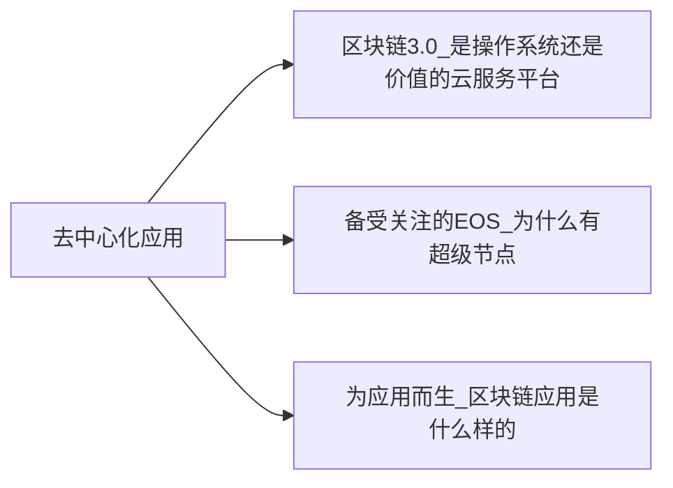

+++
title = "区块链超入门-3-区块链3.0去中心化应用-3.0冷知识"
date = "2021-05-02T20:40:10+08:00"
tags = ["区块链超入门"]
slug = "区块链超入门-3-区块链3.0去中心化应用-3.0冷知识"

+++

### 3.0 冷知识1-EOS的密钥被盗后的恢复

EOS的账户体系还有一个与绝大多数区块链项目不一样的特征，它提供了“密钥被盗后的恢复”。对其他的区块链项目而言，密钥丢失，则一切都丢失了，无法恢复，而 EOS 基于它的用户权限机制提供了恢复功能。

这有很大争议，但可能是需要的。过去，区块链项目假设，你得管理好自己的密钥，没人为你负责。但在现实生活中，当丢掉了银行的密码之后，我们希望在提供相关证明之后，银行能帮忙找回密码，帮我们找回自己的钱。

当然，EOS 提供的恢复功能只有在非常严格的情况下才可以做到：假设你的私钥被黑客盗走了，在这种情况下，你可以用过去 30 天中有效的 owner 权限对应的私钥，和你预先设定的账户恢复合作伙伴（account recovery partner）重置账户的私钥。这样你可能夺回了账户的所有权。

> EOS 白皮书讨论说：“这个过程与简单的多重签名机制有极大的不同。通过多重签名的交易，有一个对象会执行并参与每一笔交易。然而，账户恢复合作伙伴仅参与了恢复的过程，并没有权力参与日常的交易。这极大地降低了相关参与者的成本和法律责任。”

按照 BM 之前设计的 Steem 区块链，要保证你的账户中的数字资产不被盗走，还需要其他机制的协同。如果黑客获得你的账户的所有权，可以立刻将你的账户中的数字资产转走，那么，你的数字资产就丢失了，你即便恢复了账户也毫无用处。

在 Steem 区块链中有这样的机制的示例。比如，如果我们把 STEEM 币存入一个储蓄账户（也就是转化所谓的 STEEM Power），那么我们要从中把 STEEM 币取出来，首先要经过一个 7 天的等待期，然后在接下来的 13 周中，每周可以取出 1/13。如果有这样的机制，那么只要在一定的时间内进行了账户恢复，重新获得账户的控制权，我们的数字资产就还没有被全部盗走。

### 冷知识2-区块链应用的六个条件

《EOS技术白皮书》给出了应用所需的六个条件分别如下：

1. 支持百万级别的用户（support millions of users），需要能够处理数千万日活跃用户的区块链技术。
2. 使用免费（free usage），应用开发人员需要具备灵活性，能够为用户提供免费服务；用户不必为了使用平台或从平台的服务中受益而付费。
3. 轻松升级和故障修复（easy upgrades and bug recovery），区块链平台必须对软件和智能合约的升级提供支持。
4. 延迟低（low latency），及时地反馈是良好用户体验的基础。
5. 串行性能（sequential performance），有些应用程序由于必须顺序执行命令，无法用并行算法进行实现。区块链需要提供强大的串行性能支持。
6. 并行性能（parallel performance），大型应用程序需要在多个CPU和计算机之间分配工作负载。

> 《EOSIO技术白皮书》翻译版：http://blog.eosdata.io/index.php/2018/04/28/eos-io-whitepaper-v2/；英文版：https://github.com/EOSIO/Do-cumentation/blob/master/TechnicalWhitePaper.md#accounts。