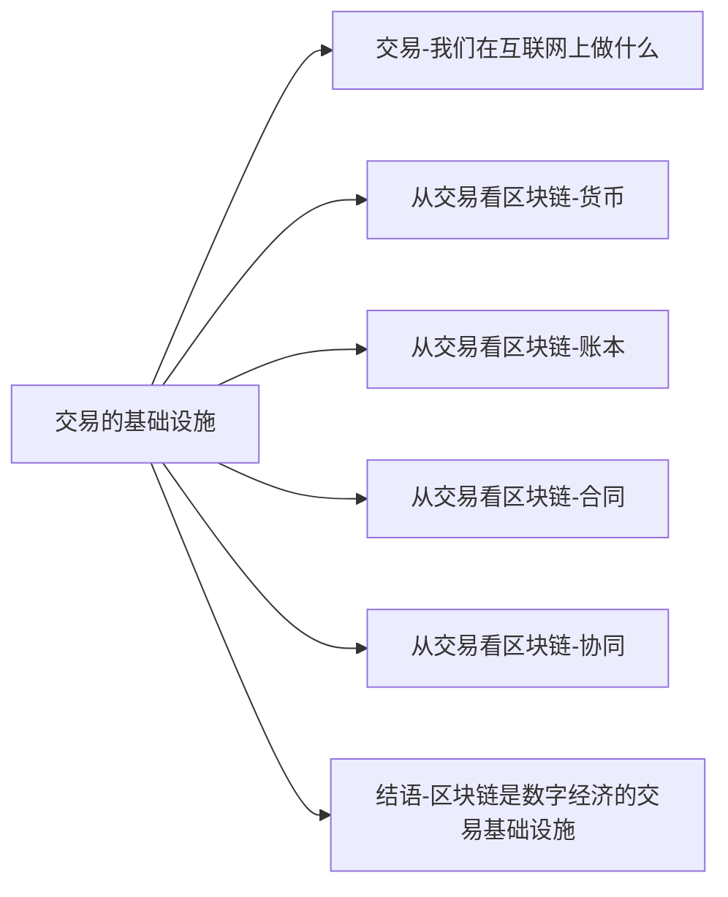

+++
title = "区块链超入门-4-区块链未来交易的基础设施-1.0交易-我们在互联网上做什么"
date = "2021-05-02T20:17:10+08:00"
tags = ["区块链超入门"]
slug = "区块链超入门-4-区块链未来交易的基础设施-1.0交易-我们在互联网上做什么"

+++

### 1.0 交易——我们在互联网上做什么

区块链给数字世界带来了价值表示和价值转移这两个基础功能,带来了具有唯一性的通证.随着区块链的发展,推出关于价值交易的应用变得容易.从互联网技术的角度出发,我们观察区块链可以得到如上启示。

在本章中，我们将试图从更宏观的层面去看，区块链会给我们的经济与生活带来了什么改变。我们认为，区块链给互联网带来的变化主要体现在交易上，它可能促成全新的交易基础设施，让互联网上的交易从现在的中心化变成去中心化，大幅度地提升交易的效率，进一步带来交易大爆炸。

过去数十年间，信息互联网改变了交易信息的那一半。而现在，基于区块链技术的价值互联网将再次变革交易中关于价值的那一半，推动互联网在生活与产业中应用。

#### 从比特币说起：数字货币、数字资产、价值交易

比特币是一个专为电子现金设计的系统，它采用了一个只有数字现金才用得到的独特设计。现代的货币是存在于账本之中的，通过交易（发行的交易、转移的交易）来确认，比特币系统亦是如此。在技术上，它采用了分布式账本和去中心网络来实现，与实体世界中的中央银行和银行形成鲜明对照。

对如何在数字世界中实现去中心化的价值表示和价值转移，比特币系统完美地完成了概念验证。用来存储不可篡改的状态的账本和去中心网络，让区块链与互联网中已有的数据库、中心化服务器形成对照。

在区块链系统实现通用化和往应用发展的过程中，务实的人开始意识到，互联网和数字世界主要需要的并不是现行的各国央行体系和全球金融体系相冲突的新数字货币，而可能是：在数字世界中如何表示资产，如何通过编程实现资产在不同主体间的转移。

之后，区块链进入了2.0即以通证表示的数字资产时期。当资产以数字形式表示后，它开始具有比特的数字化特征：可以方便地转移，可以编程处理，可以由程序代码来自动运转。当区块链处理的事物从“数字现金”变成“数字资产”时，可能性开始出现：

> * 区块链有可能改变所有的财务帐本。政府、企业的所有与财务有关的账本所处理的都是资产。
> * 区块链有可能改变除财务之外的其他账本，比如房地产契约、证书等。
> * 区块链有可能改变原本并不用常规账本管理的事物的处理方式，比如互联网上的社交互动等。

在新事物的对照之下，我们能更清楚地看到，在实体世界中，资产或价值转移的方式是通过账本的记录。一直以来，在数字世界中，我们也在依靠中心化的信息中介来处理各种账本。而区块链带来的关键变化是，现在我们可以采用分布式账本与去中心网络。

图4 -1 从货币到资产、再到应用

但数字资产时期出现了过度金融化的倾向，出现极大的投机泡沫。我们为此大为担心，认为区块链这一极具前景的技术可能走偏了方向。以互联网作为借鉴，区块链应当“超越金融，走向应用”。区块链3.0时期是以更复杂、更智能的方式进行价值的交易（见图4-1）。不过，从区块链1.0到区块链3.0，不变的是“价值的交易”。

#### 从信息互联网到价值互联网：在交易处交汇

我们还可以从信息互联网和价值互联网的不同发展路径看交易。

信息互联网是从信息开始的。但正如所有人已经看到的，互联网的价值不是信息本身，而是交易：网络零售、服务交易、企业间交易。经过20多年的发展，再互联网上，人们想要进行的是交易，这一点非常明确。

但是，由于信息互联网的特点，现在所有的交易都是“中心化”的，由一个可信第三方担任中介。问题是，现在的信息互联网上的各种交易平台，在信息匹配上非常高效，但在交易的信用上，是利用已有的技术勉力为之。

以区块链为技术基础的价值互联网，则是专门为价值表示和价值转移设计的，它在技术基础上是去中心化的。因此，信息互联网从信息出发，价值互联网从货币出发，最终交汇融合在交易（见图4 - 2）。并且，有了区块链，互联网上的交易方式将大不一样，可能从中心化走向去中心化或分布式。

图 4-2 从信息互联网到价值互联网：在交易处交汇

总的来说，区块链1.0是关于货币的，区块链2.0是用通证表示的资产，区块链3.0现在看起来是资产的复杂交易应用。而未来在各种条件逐渐齐备之后，区块链可能成为更广泛的价值交易的基础设施（见图4 - 3）

图 4-3 区块链的未来：成为价值交易的基础设施

#### 区块链：再次变革互联网

梳理互联网产业发展史，我们可以看到，迄今为止互联网改变每个产业领域的方式是，将产业变成以互联网平台来连接生产者与消费者的格局。如果在产业领域中本来有平台角色，比如在零售中有超市、购物中心等平台，则互联网以效率更高、对消费者更便利的电商平台与移动电商平台取代它们。如果在产业领域中本没有平台角色，比如在机票预订、餐饮外卖、打车出行等领域，则在互联网化的过程中，互联网平台（如携程、美团外卖、滴滴打车等）会涌现。

互联网平台成为一个个产业中的新的主导者，它们推动产业链的升级迭代。在探讨中国与全球互联网产业的《平台时代》（方军、程明霞、徐思彦 / 著）一书中，我们认为，互联网平台是数字经济的主要资源配置与组织方式。我们所试图揭示的是从市场到企业，再到互联网平台这样的演变历程。

> 《平台时代》已由机械工业出版社华章公司于2018年出版。

在近一个世纪前，发生了从市场到企业的跃迁。在经过20多年的高速发展后，互联网平台的大规模涌现让我们看到，现在从企业到平台的跃迁也非常明确。

来细看从市场到企业、再到平台的变迁过程。

在1937年出版的《企业的性质》中，科斯提出交易成本理论，对企业的本质加以解释：使用市场的价格机能的成本相对偏高，因而形成企业机制，它是人类追求经济效率所形成的组织。在之后的很多年里，大型企业是资源配置和商品生产的组织者，在一个个产业生态中扮演着关键角色。

之后，很多大型公司（如波音、沃尔玛、耐克）关注核心能力和最终产品，而把一些生产过程交由协作企业去完成，自己充当“价值交付平台”的角色。近几年，IBM商业价值研究院在报告中指出，互联网社交化促进由“企业驱动的价值交付链”向“多方驱动的价值交付平台”转变。这种所谓的“价值交付平台”是平台和企业的混合体。这类公司主要还是产品型公司，只不过以平台的方式生产产品。

当互联网、移动互联网时代到来后，互联网平台大量涌现，所有人都感受到，从企业到平台的发展已经进入新的阶段：技术驱动的互联网平台成为产业中的主导者，产业链的主导者从“产品型公司”变成了“平台型公司”。在中国互联网产业中，最受关注的是阿里巴巴、腾讯、百度等基础性平台，它们提供的部分功能相当于整个数字经济的基础设施。它们不是直接从事生产，而是进行连接与匹配。因此，在进入21世纪之后哦，所有的因素综合起来，把我们带入了一个互联网平台主导的时期。

现在，区块链技术可能带来一些新变化。

一直以来，互联网平台扮演着两类中介角色（见图 4-4）：

* 信息中介，负责信息的匹配。
* 信用中介，负责价值的交换。

图4 -4 互联网平台的两个角色：信息中介、信用中介

区块链的应用萌芽已经展示了一种可能，我们不再需要信用中介，信用中介所承担的常规功能可能会由价值互联网的底层来提供。对于互联网平台来说，区块链带来的变化是矛盾的两面。一方面，区块链有可能优化互联网平台的技术系统，优化它的市场机制。另一方面，区块链又可能推动所谓的去中心化平台的出现，让现有的互联网平台消失。比如，有人大胆预测，集中化的房屋短租平台爱彼迎（Aribnb）可能会被去中心化的爱彼迎（decentralized Airbnb，dAirbnb）所取代。这都是因为，区块链可能重构信用中介的构成方式，甚至彻底消除信用中介，从而再次大幅度降低交易成本。

有人从整体上称这种变化的前景为分布式商业，也有人从个体上看，认为未来商业的形态是社区，即生产者、消费者，甚至所有其他成员都在一个社区之中。（见图4 - 5）

但不管如何命名，分布式商业活社区的重要特点是，它除了让所有成员享受交易成本的降低与交易效率的提升外，也让所有成员分享整个生态的收益。如果区块链对商业的变革真正发生，未来在一个商业生态中的主要收益不仅属于互联网平台、大型企业，而且可能按照贡献相对公平地分配给所有的参与者。区块链技术驱动产业向社区化转变的趋势还在孕育之中。

图4 -5 互联网平台与分布式社区

接下来，我们从交易的四个方面出发来看区块链技术的潜力与前景。