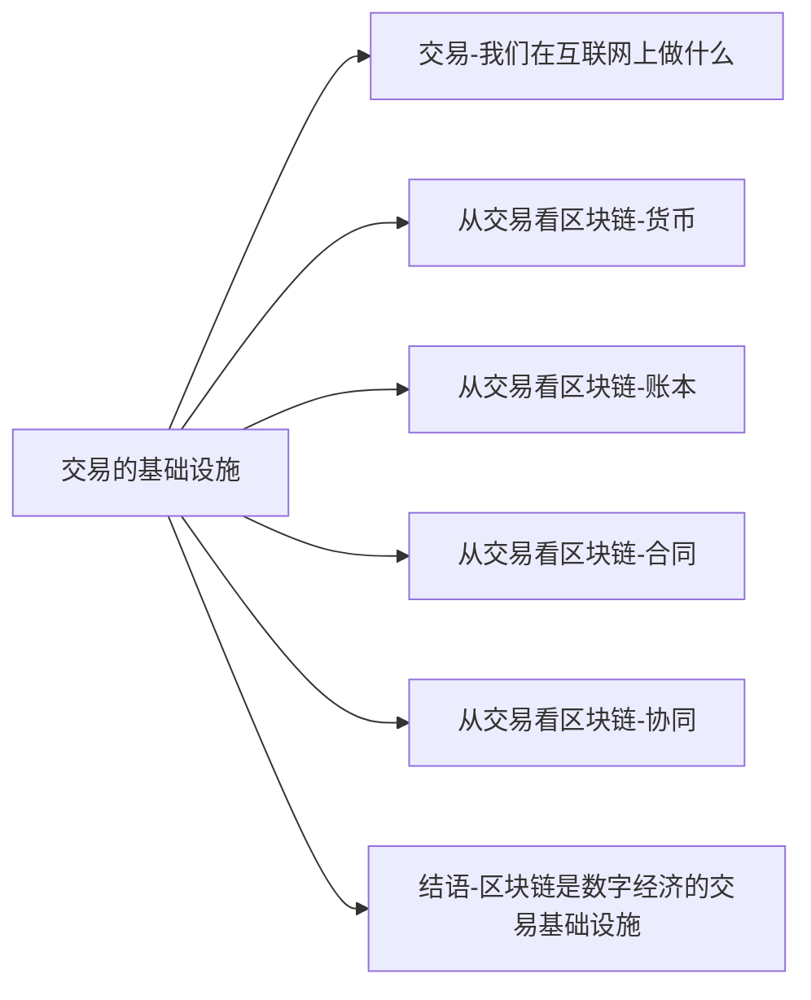

+++
title = "区块链超入门-4-区块链未来交易的基础设施-2.0从交易看区块链-货币"
date = "2021-05-02T22:17:10+08:00"
tags = ["区块链超入门"]
slug = "区块链超入门-4-区块链未来交易的基础设施-2.0从交易看区块链-货币.md"

+++

### 1.0 从交易看区块链-货币

我们可以从很多个角度来看货币,其中一个角度是,几千年来,货币的基本功能之一是作为"交易中介",其作用是降低交易成本。

货币的范围比通常理解的法定流通货币要广泛得多，站在互联网的角度看尤其如此。美国印第安纳大学教授爱德华 · 卡斯特罗诺瓦（Edward Castronova）是研究虚拟世界里的经济现象的知名经济学者，在《货币革命：改变经济未来的虚拟货币》一书中，他的团队研究了20多个在线项目，重要结论是：“所有研究对象都包含一个内部市场，每个市场都拥有自己的货币。”

“全球性数字价值转移系统（Digital Value Transfer，DVT）的原始形态已经出现，只等待一个合适的时机进入公众的视野。“当他这样展望时，比特币已经出现，但区块链与通证还没有进入大众的视野。而现在，他所预测的正在变成现实，”合适的时机“可能到来了。卡斯特罗诺瓦从互联网项目和游戏中看到了”内部市场“”内部货币“，他看到这些内部市场和内部货币都像互联网一样全部联系到一起形成一个”全球数字价值转移系统“（见图4 -6）。现在我们看到，把它们连起来的是区块链技术。

图 4-6 数字价值转移系统

#### 换一种角度看货币

卡斯特罗诺瓦说的货币和经济学家常说的货币并部一样。经济学家所说的货币，一般来说是指黄金白银、金币银币、现代国家发行的纸币以及银行卡等代表的电子货币。而在他的讨论中，货币的定义要广泛的多，战俘营中的香烟、航空公司里程、咖啡店中盖十个印送一杯咖啡的优惠、游戏里的金币，都是广义的货币。比特币与各种加密数字货币或通证，当然亦属于广义的货币。

卡斯特罗诺瓦把除法定货币之外的货币分成几类：企业货币、行业货币和游戏币为代表的虚拟货币。

企业货币，指的是航空公司的里程、星巴克买十送一的优惠，都是由一家企业发行的，仅可以在这个企业内部使用。

行业货币，指的是一个行业中可用的货币。比如，如果你领的不是一家航空公司的里程积分，而是一个联合体如星空联盟的里程积分，那它就是一种行业货币。又比如，提供全球机场贵宾休息厅服务的Priority Pass发行的可被看成一种特殊的行业货币，它是进入机场休息厅的”令牌“。比特币也可被看成一种典型的行业货币。

以游戏币为代表的虚拟货币，指的是在游戏里可以用的各种金币、钻石。玩家可以用金钱去购买这些游戏金币，也可以玩游戏比如按时间长度或战斗胜利来获得游戏金币。

你应该已经发现，这几种所谓的广义货币——企业货币、行业货币、游戏币等虚拟货币，与央行、银行和金融体系所发行的货币没什么关系，都是由企业发行的。它们与国家发行的法定货币是截然不同的，因而可称之为”私人货币“。在《货币革命》中，卡斯特罗诺瓦专门研究了美国关于货币的法律，并得出了一个明确的结论：企业或个人发行这些私人货币，是完全符合美国法律的。当然如果严谨的话，这些”货币“字样上或许都应该加上引号，以与国家发行的货币区分开。

作为专门研究虚拟世界货币现象的经济学家，在区块链和加密数字货币的背景下看，卡斯特罗诺瓦的立场非常有趣：在说起货币时，他没那么一本正经，而主要关注货币的本质属性。通货有三个功能：交易中介、计量单位、价值储藏。而他发现了虚拟货币的一种独特的功能，可称为通货的第四种功能。这可能同样是现在的加密数字货币或通证的核心功能，虽然尚未引起足够的重视。

他研究金钱，发现金钱能给人们带来快乐（见图4-7）。他的意思不是说金钱本身有价值让你感到快乐，而是说，你看着自己银行卡上的数字增长，会能感受到快乐。类似地，当我们看到自己的虚拟账户上的积分数字在增长时，也会感到类似的快乐。卡斯特罗诺瓦说：”通货或许具有第四种社会功能，即为人们带来愉悦的享受。“

